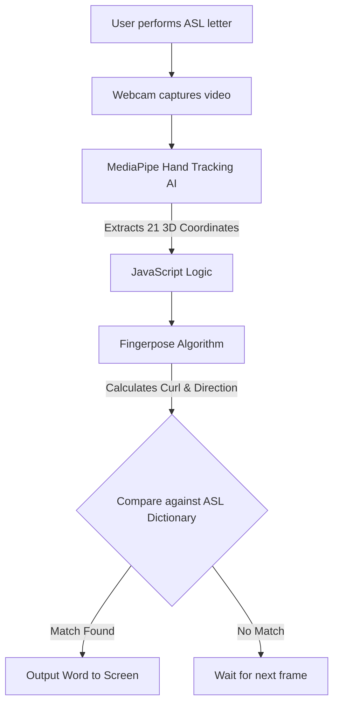

# Project Documentation: ASL Sign Language Helper 🖐️💬

*Note: Please fill in the bracketed information like [Your Name] before exporting this document to PDF for your submission!*

---

## 1. Participant Information
- **Project Title:** Beyond Words - ASL Sign Language Helper
- **Team Name:** Beyond Words
- **Participant Name:** Suryansh Sahu
- **Category Level:** Senior
- **Platform/Framework:** HTML, CSS, JavaScript, MediaPipe (Google), Fingerpose

## 2. Theme Analysis
Deaf and hard-of-hearing individuals often face communication barriers when interacting with people who do not know sign language. This project leverages the power of computer vision and Artificial Intelligence to bridge this communication gap, demonstrating how technology can promote accessibility, inclusion, and education by translating American Sign Language (ASL) into text in real-time.

## 3. Problem Statement
Learning sign language takes years of practice, making it difficult for the deaf community to communicate instantly with the general public. Furthermore, people who want to learn ASL often struggle to know if they are forming the hand shapes correctly. There is a need for an automated, real-time sign language translator that works entirely through a standard webcam without requiring expensive sensors or gloves.

## 4. Proposed Solution
I built an AI-powered web application that uses a webcam to track hand landmarks in 3D space in real-time. By applying advanced mathematical modeling to calculate the curl and direction of each finger, the system can instantly recognize American Sign Language gestures. The application runs entirely in the browser, providing instant translation to text while ensuring complete user privacy.

## 5. System Flow / Logic

## 6. Design Decisions
- **Edge Computing (In-Browser AI):** I chose to run the entire AI model directly in the web browser using JavaScript rather than on a cloud server. This means the video feed never leaves the user's computer, ensuring 100% privacy and zero network latency.
- **Heuristic Math vs Deep Learning:** Instead of training a massive neural network (which requires thousands of images and heavy processing power), I utilized the Fingerpose library. It uses mathematical rules (heuristics) to determine if a finger is "Fully Curled", "Half Curled", or "Straight", and which direction it points. This makes the system incredibly lightweight and fast on any device.
- **Premium Tech Aesthetic:** I designed the interface using a modern color palette featuring Dark Navy, Electric Blue, and Cyan to give the application a premium, advanced technology feel. The glowing Cyan border on the camera feed draws the user's eye directly to the active AI recognition area.

## 7. Implementation Approach
1. **Frontend Architecture:** Built the structure using HTML and custom CSS, creating a responsive layout with a dedicated area for the camera feed, a dynamic dictionary, and a gamified learning mode.
2. **Computer Vision Setup:** Imported Google's MediaPipe Hands model to handle the complex task of identifying the 21 unique joints (landmarks) of a human hand from a 2D image.
3. **Gesture Dictionary Definition:** Using the Fingerpose library, I meticulously programmed the specific rules for 10 common ASL words (e.g., HELLO, WATER, YES, NO).
4. **Real-Time Loop:** Programmed the JavaScript `onResults` function to run roughly 30 times a second, constantly passing the 3D hand coordinates to the Fingerpose estimator and updating the DOM when a word scores a high confidence match.

## 8. Future Improvements
- **Word Translation (Dynamic Time Warping):** Currently, the system recognizes static signs. The next major upgrade would be to track motion over time to recognize full ASL words and sentences.
- **Text-to-Speech:** Integrate the Web Speech API so that as the user signs, the computer speaks the translated text out loud for fully hands-free conversations.
- **Expanded Dictionary:** Build a visual interface that allows users to quickly add and save custom heuristic rules for new signs without touching the code.

---

## 9. AI Usage Disclosure & Log

**Disclosure:** I used Google Gemini as an AI pair-programmer and mentor during the development of this project.

| AI Tool Used | Purpose of Use | Output Generated | Student Contribution or Modification |
| :--- | :--- | :--- | :--- |
| Google Gemini | Research & Architecture | Suggested using Google MediaPipe combined with Fingerpose for in-browser gesture detection without needing a backend server. | Evaluated the options and decided this was the best approach for privacy and speed. |
| Google Gemini | Code Generation | Generated the boilerplate JavaScript code to connect the webcam to the MediaPipe Hand tracking model. | Integrated the generated code into my custom UI and modified the event loops to handle the drawing of the hand skeleton on the HTML canvas. |
| Google Gemini | Algorithm Assistance | Helped define the complex Fingerpose mathematical rules (curls and directions) for specific ASL words. | Tested the gestures in real-time, tweaked the confidence thresholds, and adjusted the rules to prevent conflicts between similar signs (like NO and NUMBER 3). |
| Google Gemini | UI/UX Design | Provided CSS templates for a Dark Navy + Cyan aesthetic. | Customized the color palette, sizing, layout, and typography to create a cohesive and original user experience. |

## 10. Project Demonstration (Notes for Presentation)
*When presenting to the judges, make sure to cover:*
- **The Core Problem:** Explain that learning ASL is hard, and communication shouldn't require typing.
- **The Tech Choice:** Highlight that everything runs in the browser. This is a huge technical achievement because it means the app is private and works offline!
- **The Mathematics:** Open the code and show them how you define a letter (e.g., showing how the index finger must be straight for a specific letter). This proves you understand the computational logic behind the AI.
- **The Demo:** Sign a few letters live to show how quickly the AI recognizes your hand structure.
